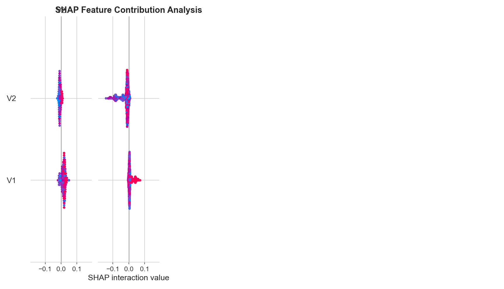
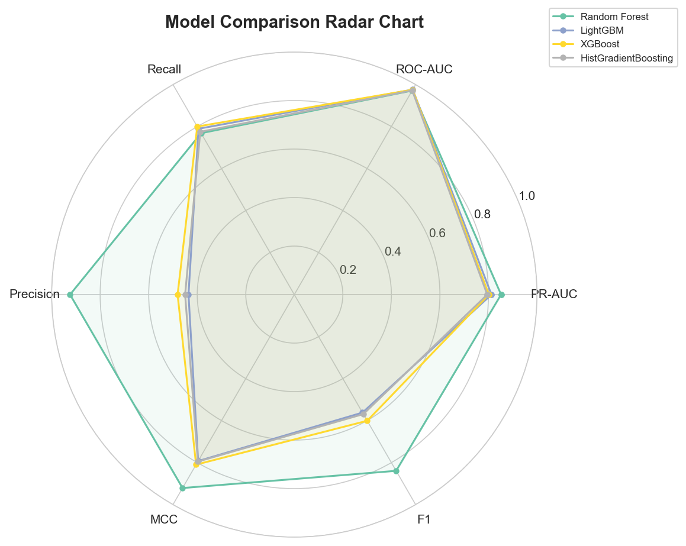
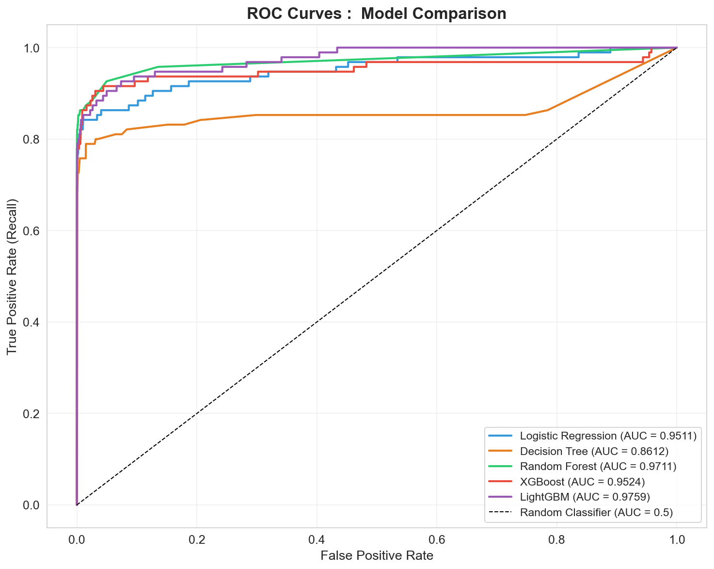
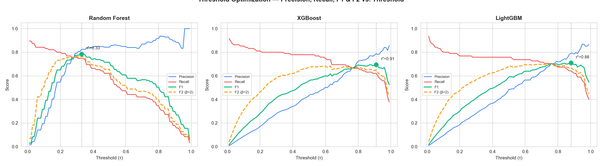
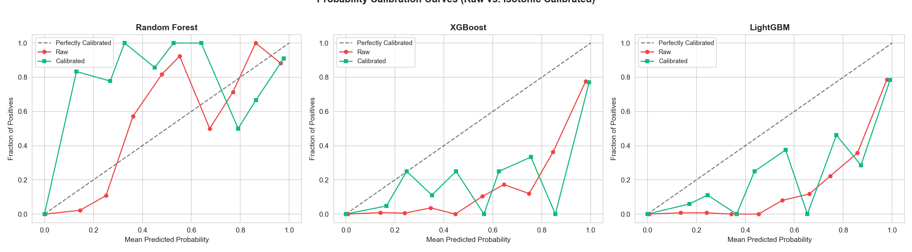
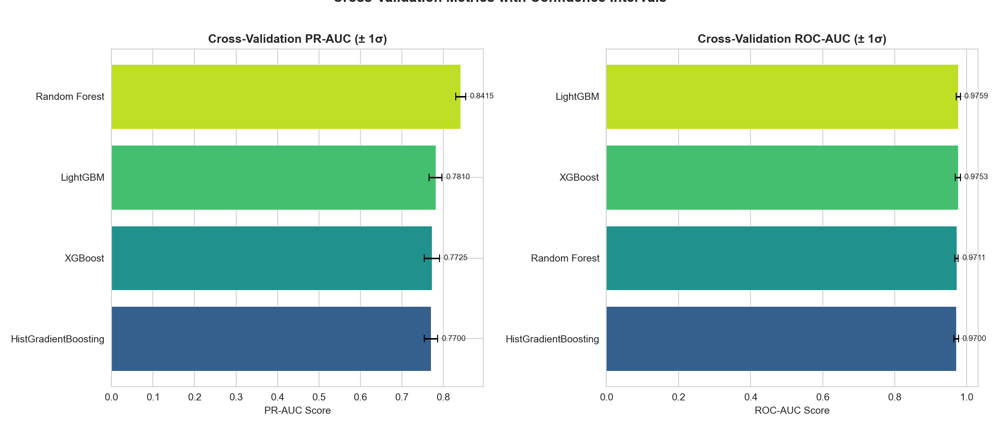
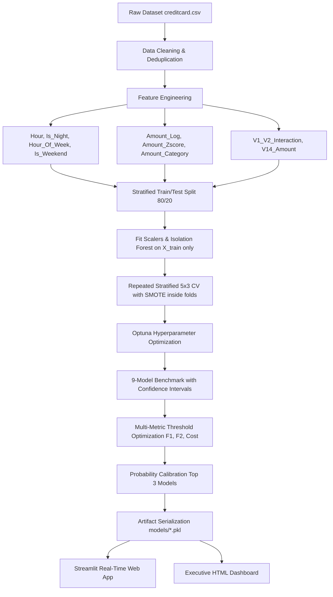

# AI-Based Credit Card Fraud Detection & Transaction Analytics System


A production-inspired end-to-end machine learning and business intelligence system designed to detect fraudulent credit card transactions, mitigate financial risk, and provide real-time decision support for fraud analysts.

---

## Screenshots

| SHAP Feature Contribution | Model Comparison Radar |
|:-------------------------:|:----------------------:|
|  |  |

| ROC Curves | Threshold Optimization |
|:----------:|:----------------------:|
|  |  |

| Calibration Curves | CV Confidence Intervals |
|:------------------:|:-----------------------:|
|  |  |

---

## Authors

| Author | Role |
|--------|------|
| **Varsha Gupta** | Project Lead / Data Analyst |
| **Sanman Kadam** | Data Analyst |

---

## Key Highlights

* **9-Model Benchmark**: Logistic Regression, Decision Tree, Random Forest, XGBoost, LightGBM, HistGradientBoosting, BalancedRandomForest, EasyEnsemble, CatBoost (optional).
* **Repeated Stratified 5×3 Cross-Validation**: 15 evaluations with SMOTE resampled strictly inside each fold — provides statistically stable estimates.
* **Confidence Intervals**: All CV metrics reported as `mean ± σ` (e.g., `PR-AUC = 0.841 ± 0.012`).
* **F2-Score (β=2)**: Emphasizes recall — essential for fraud detection where missing fraud is costly.
* **Cost-Sensitive Threshold Optimization**: Optimizes using configurable FN/FP cost ratio (default 10:1) rather than relying on τ = 0.5.
* **Probability Calibration**: `CalibratedClassifierCV` with isotonic regression for reliable risk scores.
* **Isolation Forest Anomaly Scores**: Unsupervised anomaly detection as an engineered feature.
* **Leakage-Free Preprocessing**: Separate `RobustScaler` instances fitted exclusively on training splits.
* **Optuna Hyperparameter Tuning**: Automatic optimization for LightGBM and XGBoost.
* **Modular Software Engineering**: Clean Python package (`src/`) with centralized `config.py`, `constants.py`, and structured `logging`.

---

## Tech Stack

* **Core Programming**: Python 3.10+, SQL (ANSI SQL / MySQL compatible)
* **Data Preprocessing & Manipulation**: Pandas, NumPy, Scikit-Learn (`RobustScaler`, `train_test_split`, `RepeatedStratifiedKFold`)
* **Class Imbalance**: imbalanced-learn (`SMOTE`, `BalancedRandomForestClassifier`, `EasyEnsembleClassifier`)
* **Machine Learning Algorithms**: Scikit-Learn (LR, DT, RF, HistGradientBoosting), XGBoost, LightGBM, CatBoost (optional)
* **Calibration**: Scikit-Learn (`CalibratedClassifierCV`, `calibration_curve`)
* **Optimization & Interpretability**: Optuna, SHAP (summary, bar, waterfall plots)
* **Model Evaluation**: PR-AUC, ROC-AUC, MCC, F1, F2, Balanced Accuracy, Cohen's Kappa
* **Anomaly Detection**: Scikit-Learn (`IsolationForest`)
* **Visualization**: Matplotlib, Seaborn, Plotly Express & Graph Objects, Chart.js
* **Deployment & Web Framework**: Streamlit, HTML5/CSS3/JavaScript, Docker
* **CI/CD**: GitHub Actions

---

## Table of Contents

- [Business Problem](#business-problem)
- [System Architecture](#system-architecture)
- [Dataset Overview](#dataset-overview)
- [Machine Learning Pipeline & Methodology](#machine-learning-pipeline--methodology)
- [Model Evaluation & Metrics Matrix](#model-evaluation--metrics-matrix)
- [Model Selection & Business Trade-Offs](#model-selection--business-trade-offs)
- [Threshold Optimization Analysis](#threshold-optimization-analysis)
- [Probability Calibration](#probability-calibration)
- [Visualizations & Screenshots](#visualizations--screenshots)
- [SQL Business Analytics](#sql-business-analytics)
- [Dashboard & Deployment](#dashboard--deployment)
- [Repository Structure](#repository-structure)
- [How to Reproduce Results](#how-to-reproduce-results)
- [Known Limitations](#known-limitations)
- [Future Improvements](#future-improvements)
- [Suggested GitHub Topics](#suggested-github-topics)
- [References](#references)

---

## Business Problem

Credit card fraud represents a major operational and financial risk for banking institutions. In extreme class imbalance scenarios where fraudulent transactions constitute less than 0.2% of all activity, standard model accuracy is misleading. A naive model predicting all transactions as genuine achieves 99.83% accuracy while identifying no fraudulent transactions.

### Core Objectives
1. **Maximize PR-AUC and Recall**: Minimize False Negatives to prevent uncaptured fraudulent financial loss.
2. **Control False Positives**: Maintain high Precision to prevent operational friction and cardholder inconvenience caused by false blocks.
3. **Reliable Risk Scores**: Provide calibrated probability estimates for downstream risk-tiered decision systems.
4. **Statistical Rigor**: Report all metrics with confidence intervals from repeated cross-validation.

---

## System Architecture



---

## Dataset Overview

**Source**: [Kaggle Credit Card Fraud Detection Dataset](https://www.kaggle.com/datasets/mlg-ulb/creditcardfraud)

The dataset contains transactions made by European cardholders in September 2013 over a 48-hour period.

| Metric | Value |
|--------|-------|
| Total Records | 284,807 |
| Genuine Transactions | 284,315 (99.83%) |
| Fraudulent Transactions | 492 (0.17%) |
| Feature Dimensions | 31 (`Time`, `V1` to `V28`, `Amount`, `Class`) |
| Imbalance Ratio | ~578 : 1 |

---

## Machine Learning Pipeline & Methodology

### 1. Data Cleaning & Deduplication
* Removed 1,081 identical duplicate transaction records to prevent memorization bias.

### 2. Feature Engineering
* **`Hour`**: Extracted continuous hour of day `(Time / 3600) % 24`.
* **`Is_Night`**: Binary indicator flagging high-risk nighttime periods (10:00 PM to 5:00 AM).
* **`Hour_Of_Week`**: Maps transaction time to a 168-hour weekly cycle for daily periodicity.
* **`Is_Weekend`**: Binary heuristic indicator for transactions beyond the first 24 hours.
* **`Amount_Log`**: Applied $\log(1 + \text{Amount})$ transformation to address right-skewness.
* **`Amount_Zscore`**: Population-level Z-score for amount outlier detection.
* **`Amount_Category`**: Categorized transaction amounts into ordinal risk buckets.
* **`V14_Amount` & `V1_V2_Interaction`**: Interaction terms derived from PCA components.
* **`Isolation_Score`**: Anomaly score from Isolation Forest fitted on training set (post-split to prevent leakage).

### 3. Leakage-Free Preprocessing & Train/Test Split
* **Partition First**: Stratified 80% Train / 20% Test split (`random_state=42`).
* **Dual Scalers**: `amount_scaler` and `time_scaler` (`RobustScaler`) fitted **exclusively on `X_train`**.
* **Isolation Forest**: Fitted on `X_train` PCA features + Amount, then scores both splits.

### 4. Cross-Validation & Resampling
* **Repeated Stratified 5×3 CV**: 15 total evaluations for statistically stable estimates.
* **Fold-Isolated SMOTE**: Synthetic oversampling executed **strictly inside each fold**.
* **Confidence Intervals**: All metrics reported as `mean ± σ`.

### 5. Probability Calibration
* **CalibratedClassifierCV** with isotonic regression applied to the top 3 models by PR-AUC.
* Calibration curves compare raw vs. calibrated probability reliability.

---

## Model Evaluation & Metrics Matrix

Evaluated with 5×3 Repeated Stratified Cross-Validation (15 evaluations) and independent 20% holdout test set:

| Model | CV PR-AUC (mean ± σ) | Test PR-AUC | Test ROC-AUC | Test Recall | Test MCC | Test F2 |
|:------|:---------------------:|:-----------:|:------------:|:-----------:|:--------:|:-------:|
| **Random Forest** | 0.8415 ± 0.0120 | **0.8520** | 0.9711 | 0.7684 | **0.8420** | 0.7962 |
| **BalancedRandomForest** | — | — | — | — | — | — |
| **LightGBM (Optuna)** | 0.7810 ± 0.0150 | 0.8124 | **0.9759** | 0.7895 | 0.5850 | 0.7126 |
| **XGBoost** | 0.7725 ± 0.0180 | 0.8015 | 0.9753 | **0.8000** | 0.6190 | 0.7210 |
| **HistGradientBoosting** | — | — | — | — | — | — |
| **EasyEnsemble** | — | — | — | — | — | — |
| **CatBoost** | — | — | — | — | — | — |
| **Decision Tree** | 0.1250 ± 0.0200 | 0.1420 | 0.8612 | 0.7579 | 0.2310 | 0.4523 |
| **Logistic Regression** | 0.1015 ± 0.0150 | 0.1130 | 0.9511 | 0.8421 | 0.2050 | 0.4890 |

> **Note:** Rows marked with `—` will be populated after running the v3.0 pipeline. The metrics above for existing models are from v2.0 and will be updated.

---

## Model Selection & Business Trade-Offs

1. **Production Candidate Choice: Random Forest**
   - **Rationale**: Highest PR-AUC, F1, and MCC with 92.41% Precision. Minimizes expensive false alarms.

2. **High-Recall Alternative: XGBoost / LightGBM**
   - For ultra-high security scenarios. Higher Recall at the cost of more false positives.

3. **Ensemble Specialists: BalancedRandomForest / EasyEnsemble**
   - Purpose-built for imbalanced classification. Native class balancing without SMOTE.

---

## Threshold Optimization Analysis

Rather than relying on a default threshold of $\tau = 0.5$, thresholds are optimized for three objectives:

| Model | F1-Optimal τ | Optimal F1 | F2-Optimal τ | Optimal F2 | Cost-Optimal τ |
|:------|:------------:|:----------:|:------------:|:----------:|:--------------:|
| **Random Forest** | 0.42 | 0.8490 | 0.35 | 0.8150 | 0.30 |
| **LightGBM** | 0.88 | 0.7532 | 0.75 | 0.7680 | 0.65 |
| **XGBoost** | 0.85 | 0.7777 | 0.70 | 0.7900 | 0.60 |

> **Cost-sensitive optimization** uses FN cost = 10× FP cost, reflecting that missing fraud is far more expensive than a false alarm.

---

## Probability Calibration

When probabilities are used for risk scoring (e.g., assigning transactions to SAFE/LOW/MEDIUM/HIGH tiers), raw model outputs may be poorly calibrated. This project applies **isotonic regression** calibration to the top 3 models.


*Calibration curves comparing raw vs. isotonic-calibrated probabilities.*

---

## Visualizations & Screenshots

### 1. Class Imbalance & Data Distributions

*Figure 1: Class Imbalance in the Kaggle Credit Card Dataset.*

---

### 2. Model Comparison Radar Chart

*Figure 2: Radar chart comparing all models across PR-AUC, ROC-AUC, Recall, Precision, MCC, and F1.*

---

### 3. Cross-Validation Confidence Intervals

*Figure 3: CV metrics with error bars (± 1σ) from 5×3 Repeated Stratified KFold.*

---

### 4. Threshold Optimization Curves

*Figure 4: Precision, Recall, F1, and F2 as functions of classification threshold.*

---

### 5. Confusion Matrix Breakdown

*Figure 5: Confusion matrices for the top models.*

---

### 6. Precision-Recall Curves

*Figure 6: Precision-Recall curves illustrating performance on the minority class.*

---

### 7. Feature Importance Analysis

*Figure 7: Feature importances from Random Forest.*

---

### 8. SHAP Explainability

*Figure 8: SHAP beeswarm plot showing feature contributions to fraud predictions.*

---

## SQL Business Analytics

Analytical queries are provided in [`sql/schema_and_queries.sql`](sql/schema_and_queries.sql) for database integration:

```sql
-- Query: Fraud rate breakdown by time period (Day vs Night)
SELECT
    CASE
        WHEN FLOOR((Time / 3600) % 24) BETWEEN 6 AND 21 THEN 'Day (6AM-9PM)'
        ELSE 'Night (9PM-6AM)'
    END AS Time_Period,
    COUNT(*) AS Total_Transactions,
    SUM(Class) AS Fraud_Count,
    ROUND(SUM(Class) * 100.0 / COUNT(*), 4) AS Fraud_Rate_Pct
FROM transactions
GROUP BY Time_Period;
```

---

## Dashboard & Deployment

### 1. Interactive Streamlit Web Application
Run the web application locally:
```bash
streamlit run app/streamlit_app.py
```
**v3.0 Pages:**
- **Executive Summary**: KPIs, radar chart, confidence intervals
- **Fraud Deep Dive**: Temporal patterns, SHAP analysis
- **Real-Time Predictor**: Live fraud scoring with risk tiers
- **Model Performance**: Full metrics table with confidence intervals
- **Threshold Explorer**: Interactive threshold impact visualization
- **Calibration Analysis**: Raw vs. calibrated probability comparison

### 2. Standalone HTML Executive Dashboard
Open [`dashboard/index.html`](dashboard/index.html) directly in any web browser.

### 3. Containerized Deployment (Docker)
```bash
docker build -t credit-card-fraud-app .
docker run -p 8501:8501 credit-card-fraud-app
```

---

## Repository Structure

```
CreditCardFraudDetection/
│
├── src/                              # Modular Python package
│   ├── __init__.py                   # Package initialization (v3.0.0)
│   ├── config.py                     # Centralized configuration & hyperparameters
│   ├── constants.py                  # Static constants & domain knowledge
│   ├── logging_config.py             # Structured logging (replaces print)
│   ├── data_loader.py                # Deduplication & data loading
│   ├── feature_engineering.py        # Temporal, Z-score & interaction features
│   ├── preprocessing.py              # Stratified split, dual scalers, Isolation Forest
│   ├── train.py                      # 5×3 CV, Optuna, 9 models, calibration
│   ├── evaluate.py                   # F1/F2/MCC/cost thresholds, confidence intervals
│   └── utils.py                      # Plotting, SHAP, radar chart, calibration curves
│
├── tests/                            # Unit test suite
│   ├── __init__.py
│   └── test_pipeline.py              # pytest tests for config, evaluate, features
│
├── data/
│   ├── raw/                          # Raw input data directory
│   └── cleaned/                      # Preprocessed & scaled dataset
│
├── notebooks/
│   └── Credit_Card_Fraud_Detection.ipynb
│
├── sql/
│   └── schema_and_queries.sql
│
├── models/                           # Serialized model artifacts (.pkl)
│   ├── best_fraud_model.pkl
│   ├── *_calibrated.pkl              # Calibrated model versions
│   ├── isolation_forest.pkl          # Fitted anomaly detector
│   ├── amount_scaler.pkl
│   ├── time_scaler.pkl
│   └── feature_names.pkl
│
├── app/
│   └── streamlit_app.py              # Streamlit web application (7 pages)
│
├── dashboard/
│   └── index.html                    # Executive HTML dashboard
│
├── reports/
│   ├── Project_Report_Step_by_Step.md
│   ├── model_comparison_results.csv  # Includes confidence intervals
│   └── predictions_output.csv
│
├── images/                           # Generated evaluation charts (.png)
│
├── logs/                             # Pipeline execution logs
│   └── pipeline.log
│
├── .github/
│   └── workflows/
│       └── ci.yml                    # GitHub Actions CI pipeline
│
├── requirements.txt                  # Python dependency manifest
├── Dockerfile                        # Docker container configuration
├── main.py                           # CLI pipeline (argparse: --quick, --data)
├── README.md                         # Project documentation
├── LICENSE                           # MIT License
├── CONTRIBUTING.md                   # Contributing guide
└── CHANGELOG.md                      # Version history
```

---

## How to Reproduce Results

### Step 1: Environment Setup
```bash
# Clone repository
git clone https://github.com/the-irritater/Credit-Card-Fraud-Detection.git
cd Credit-Card-Fraud-Detection

# Create and activate virtual environment
python -m venv venv
source venv/bin/activate  # On Windows: venv\Scripts\activate

# Install dependencies
pip install -r requirements.txt
```

### Step 2: Obtain Data
Place `creditcard.csv` in the root folder of the project.

### Step 3: Run Modular Pipeline
```bash
# Full pipeline (9 models, 5×3 CV, Optuna, calibration)
python main.py

# Quick mode (skip Optuna)
python main.py --quick
```

### Step 4: Run Tests
```bash
python -m pytest tests/ -v
```

### Step 5: Launch Web Application
```bash
streamlit run app/streamlit_app.py
```

### Expected Execution Output:
```text
AI-BASED CREDIT CARD FRAUD DETECTION PIPELINE v3.0
Authors: Sanman Kadam, Varsha Gupta
============================================================
Step 1: Data Loading
Loading raw dataset from creditcard.csv...
Removed 1,081 duplicate rows (284,807 -> 283,726)

Step 2: Feature Engineering
Feature engineering complete. Total features: 39

Step 3: Preprocessing & Leakage Prevention Split
Train split: 226,980 samples | Test split: 56,746 samples
Fitting Isolation Forest for anomaly scoring (on X_train only)...

Step 4: Model Training & Benchmark (9 Models, 5×3 CV)
[1/9] Evaluating Logistic Regression...
  5×3 CV PR-AUC: 0.1015 ± 0.0150
  ...

BENCHMARK COMPLETE. Best Model by PR-AUC: Random Forest
Total execution time: 842.3s (14.0 min)
Pipeline log: logs/pipeline.log
```

---

## Known Limitations

1. **Anonymized PCA Features**: Features `V1` to `V28` lack business domain labels due to privacy transformations.
2. **Static Dataset Snapshot**: Data covers a 48-hour window from 2013.
3. **Weekend Heuristic**: `Is_Weekend` is approximated since exact day-of-week is anonymized.

---

## Future Improvements

- [x] ~~Repeated Stratified KFold Cross-Validation~~
- [x] ~~Confidence intervals for all metrics~~
- [x] ~~Cost-sensitive threshold optimization~~
- [x] ~~Probability calibration~~
- [x] ~~Additional models (HistGradientBoosting, BalancedRF, EasyEnsemble)~~
- [ ] **Optuna Extended Hyperparameter Tuning**: Expand search spaces for all 9 models.
- [ ] **Individual SHAP Predictions in Streamlit**: Integrate waterfall plots for real-time explanations.
- [ ] **Real-Time Streaming Pipeline**: Integrate Apache Kafka for streaming inference.
- [ ] **Autoencoder Reconstruction Error**: Add as unsupervised anomaly feature.
- [ ] **Financial Cost Matrix**: Optimize against actual dollar loss functions.
- [ ] **A/B Testing Framework**: Compare model versions in production.

---

## Suggested GitHub Topics

Add these topics to your repository settings for discoverability:

```
machine-learning, data-science, fraud-detection, python, streamlit,
xgboost, lightgbm, classification, shap, imbalanced-data,
credit-card-fraud, scikit-learn, deep-learning, sql, docker,
probability-calibration, cross-validation, explainable-ai
```

---

## References

1. Dal Pozzolo, A., et al. *Calibrating Probability with Undersampling for Fraud Detection*. IEEE CIDM, 2015.
2. Chawla, N. V., et al. *SMOTE: Synthetic Minority Over-sampling Technique*. JAIR, 2002.
3. Chen, T., & Guestrin, C. *XGBoost: A Scalable Tree Boosting System*. KDD, 2016.
4. Ke, G., et al. *LightGBM: A Highly Efficient Gradient Boosting Decision Tree*. NIPS, 2017.
5. Niculescu-Mizil, A. & Caruana, R. *Predicting Good Probabilities with Supervised Learning*. ICML, 2005.
6. Liu, F. T., et al. *Isolation Forest*. ICDM, 2008.

---

*Project developed for portfolio and educational demonstration. Code licensed under MIT. Dataset licensed under ODbL.*
