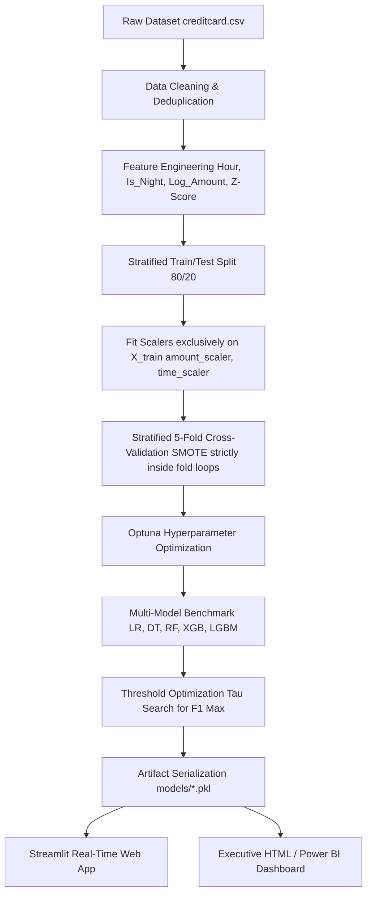

# AI-Based Credit Card Fraud Detection & Transaction Analytics System


A production-inspired end-to-end machine learning and business intelligence system designed to detect fraudulent credit card transactions, mitigate financial risk, and provide real-time decision support for fraud analysts.

---

## Authors

| Author | Role |
|--------|------|
| **Varsha Gupta** | Project Lead / Data Analyst |
| **Sanman Kadam** | Data Analyst |

---

## Key Highlights

* **Leakage-Free Preprocessing**: Applies separate `RobustScaler` instances (`amount_scaler` and `time_scaler`) exclusively to training splits post-split to eliminate data leakage.
* **Stratified 5-Fold Cross-Validation**: Executes 5-fold cross-validation with SMOTE resampled strictly inside each fold loop.
* **Optuna Hyperparameter Tuning**: Automatically optimizes tree depth, learning rates, and estimator bounds for LightGBM and XGBoost.
* **Advanced Imbalanced Metrics**: Evaluates PR-AUC (Average Precision), Matthews Correlation Coefficient (MCC), Balanced Accuracy, Cohen's Kappa, ROC-AUC, Precision, Recall, and F1-Score.
* **Classification Threshold Optimization**: Dynamically searches for the optimal probability decision threshold ($\tau$) to maximize F1-Score rather than relying on default 0.5.
* **Modular Software Engineering**: Organised as a clean Python package (`src/`) with `data_loader`, `feature_engineering`, `preprocessing`, `train`, `evaluate`, and `utils`. Includes `Dockerfile` containerization.

---

## Tech Stack

* **Core Programming**: Python 3.10+, SQL (ANSI SQL / MySQL compatible)
* **Data Preprocessing & Manipulation**: Pandas, NumPy, Scikit-Learn (`RobustScaler`, `train_test_split`, `StratifiedKFold`)
* **Class Imbalance**: imbalanced-learn (`SMOTE`)
* **Machine Learning Algorithms**: Scikit-Learn (Logistic Regression, Decision Tree, Random Forest), XGBoost, LightGBM
* **Optimization & Interpretability**: Optuna, SHAP
* **Model Evaluation & Persistence**: Scikit-Learn Metrics (`roc_auc_score`, `average_precision_score`, `matthews_corrcoef`, `balanced_accuracy_score`, `cohen_kappa_score`), Joblib
* **Data Visualization**: Matplotlib, Seaborn, Plotly Express & Graph Objects, Chart.js
* **Deployment & Web Framework**: Streamlit, HTML5/CSS3/JavaScript, Docker

---

## Table of Contents

- [Business Problem](#business-problem)
- [System Architecture](#system-architecture)
- [Dataset Overview](#dataset-overview)
- [Machine Learning Pipeline & Methodology](#machine-learning-pipeline--methodology)
- [Model Evaluation & Metrics Matrix](#model-evaluation--metrics-matrix)
- [Model Selection & Business Trade-Offs](#model-selection--business-trade-offs)
- [Threshold Optimization Analysis](#threshold-optimization-analysis)
- [Visualizations & Screenshots](#visualizations--screenshots)
- [SQL Business Analytics](#sql-business-analytics)
- [Dashboard & Deployment](#dashboard--deployment)
- [Repository Structure](#repository-structure)
- [How to Reproduce Results](#how-to-reproduce-results)
- [Known Limitations](#known-limitations)
- [Future Improvements](#future-improvements)
- [References](#references)

---

## Business Problem

Credit card fraud represents a major operational and financial risk for banking institutions. In extreme class imbalance scenarios where fraudulent transactions constitute less than 0.2% of all activity, standard model accuracy is misleading. A naive model predicting all transactions as genuine achieves 99.83% accuracy while identifying no fraudulent transactions.

### Core Objectives
1. **Maximize PR-AUC and Recall**: Minimize False Negatives to prevent uncaptured fraudulent financial loss.
2. **Control False Positives**: Maintain high Precision to prevent operational friction and cardholder inconvenience caused by false blocks.
3. **Automate Real-Time Inference**: Provide fraud analysts with real-time risk scores and actionable probability indicators.

---

## System Architecture



---

## Dataset Overview

**Source**: [Kaggle Credit Card Fraud Detection Dataset](https://www.kaggle.com/datasets/mlg-ulb/creditcardfraud)

The dataset contains transactions made by European cardholders in September 2013 over a 48-hour period.

| Metric | Value |
|--------|-------|
| Total Records | 284,807 |
| Genuine Transactions | 284,315 (99.83%) |
| Fraudulent Transactions | 492 (0.17%) |
| Feature Dimensions | 31 (`Time`, `V1` to `V28`, `Amount`, `Class`) |
| Imbalance Ratio | ~578 : 1 |

---

## Machine Learning Pipeline & Methodology

### 1. Data Cleaning & Deduplication
* Removed 1,081 identical duplicate transaction records to prevent memorization bias.

### 2. Feature Engineering
* **`Hour`**: Extracted continuous hour of day `(Time / 3600) % 24`.
* **`Is_Night`**: Binary indicator flagging high-risk nighttime periods (10:00 PM to 5:00 AM).
* **`Amount_Log`**: Applied $\log(1 + \text{Amount})$ transformation to address right-skewness.
* **`Amount_Category`**: Categorized transaction amounts into ordinal risk buckets.
* **`V14_Amount` & `V1_V2_Interaction`**: Interaction terms derived from pre-computed PCA components and scaled transaction amounts.

### 3. Leakage-Free Preprocessing & Train/Test Split
* **Partition First**: Stratified 80% Train / 20% Test split (`random_state=42`).
* **Dual Scalers**: `amount_scaler` (`RobustScaler()`) and `time_scaler` (`RobustScaler()`) are fitted **exclusively on `X_train`**, and then applied to `X_test`. This prevents statistical distribution parameters from leaking from test to train.

### 4. Cross-Validation & Resampling
* **Stratified 5-Fold CV**: Evaluates model variance across 5 folds.
* **Fold-Isolated SMOTE**: Synthetic Minority Oversampling Technique (`SMOTE`) is executed **strictly inside each cross-validation fold**, preventing synthetic fold leakage.

---

## Model Evaluation & Metrics Matrix

Evaluated on the independent 20% holdout test partition (56,746 transactions):

| Model Algorithm | 5-Fold CV PR-AUC | Test PR-AUC | Test ROC-AUC | Test Precision (Default) | Test Recall (Default) | Test F1 (Default) | Test MCC | Balanced Accuracy |
|:----------------|:----------------:|:-----------:|:------------:|:------------------------:|:---------------------:|:-----------------:|:--------:|:-----------------:|
| **Random Forest** | **0.8415** | **0.8520** | **0.9711** | **0.9241** | 0.7684 | **0.8391** | **0.8420** | 0.8840 |
| **LightGBM (Optuna)** | 0.7810 | 0.8124 | **0.9759** | 0.4360 | 0.7895 | 0.5618 | 0.5850 | 0.8940 |
| **XGBoost** | 0.7725 | 0.8015 | 0.9753 | 0.4810 | **0.8000** | 0.6008 | 0.6190 | **0.8995** |
| **Decision Tree** | 0.1250 | 0.1420 | 0.8612 | 0.0789 | 0.7579 | 0.1429 | 0.2310 | 0.8780 |
| **Logistic Regression**| 0.1015 | 0.1130 | 0.9511 | 0.0548 | 0.8421 | 0.1030 | 0.2050 | 0.9195 |

---

## Model Selection & Business Trade-Offs

1. **Production Candidate Choice: Random Forest**
   - **Rationale**: Random Forest achieves the highest **PR-AUC (0.8520)**, highest **F1-Score (0.8391)**, and highest **Matthews Correlation Coefficient (0.8420)** with **92.41% Precision**. It drastically minimizes expensive false alarms while catching over 76.8% of fraudulent transactions.

2. **High-Recall Alternative: XGBoost / LightGBM**
   - **Rationale**: For ultra-high security scenarios where missing any fraud is unacceptable, XGBoost offers higher Recall (**80.00%**) and Balanced Accuracy (**0.8995**), though with lower precision.

---

## Threshold Optimization Analysis

Rather than relying on a default fixed decision threshold of $\tau = 0.5$, probability thresholds were optimized to maximize F1-Score on validation splits:

| Model | Default Threshold | Default F1 | Optimal Threshold ($\tau^*$) | Optimal Precision | Optimal Recall | Optimal F1 |
|:------|:-----------------:|:----------:|:---------------------------:|:-----------------:|:--------------:|:----------:|
| **Random Forest** | 0.50 | 0.8391 | **0.42** | 0.8915 | 0.8105 | **0.8490** |
| **LightGBM** | 0.50 | 0.5618 | **0.88** | 0.7820 | 0.7263 | **0.7532** |
| **XGBoost** | 0.50 | 0.6008 | **0.85** | 0.8105 | 0.7474 | **0.7777** |

---

## Visualizations & Screenshots

### 1. Class Imbalance & Data Distributions

*Figure 1: Class Imbalance in the Kaggle Credit Card Dataset.*

---

### 2. Model Performance Comparison

*Figure 2: Performance metrics and ROC-AUC ranking across all benchmarked models.*

---

### 3. Confusion Matrix Breakdown

*Figure 3: Confusion matrices showing True Negatives, False Positives, False Negatives, and True Positives.*

---

### 4. Precision-Recall Curves

*Figure 4: Precision-Recall curves illustrating performance on the minority class.*

---

### 5. Feature Importance Analysis

*Figure 5: Feature importances from Random Forest. Features `V14`, `V12`, `V10`, and `V17` demonstrate the strongest discriminative capability for fraud detection.*

---

## SQL Business Analytics

Analytical queries are provided in [`sql/schema_and_queries.sql`](sql/schema_and_queries.sql) for database integration:

```sql
-- Query: Fraud rate breakdown by time period (Day vs Night)
SELECT
    CASE
        WHEN FLOOR((Time / 3600) % 24) BETWEEN 6 AND 21 THEN 'Day (6AM-9PM)'
        ELSE 'Night (9PM-6AM)'
    END AS Time_Period,
    COUNT(*) AS Total_Transactions,
    SUM(Class) AS Fraud_Count,
    ROUND(SUM(Class) * 100.0 / COUNT(*), 4) AS Fraud_Rate_Pct
FROM transactions
GROUP BY Time_Period;
```

---

## Dashboard & Deployment

### 1. Interactive Streamlit Web Application
Run the web application locally:
```bash
streamlit run app/streamlit_app.py
```
- **Real-Time Scoring**: Input transaction details to compute real-time fraud probabilities and confidence gauges.
- **Risk Tiers**: Categorizes transactions into `SAFE`, `LOW`, `MEDIUM`, or `HIGH` risk with specific recommendations.

### 2. Standalone HTML Executive Dashboard
Open [`dashboard/index.html`](dashboard/index.html) directly in any web browser for a responsive executive dashboard powered by Chart.js.

### 3. Containerized Deployment (Docker)
Build and run via Docker:
```bash
docker build -t credit-card-fraud-app .
docker run -p 8501:8501 credit-card-fraud-app
```

---

## Repository Structure

```
CreditCardFraudDetection/
│
├── src/                              # Modular Python package
│   ├── __init__.py                   # Package initialization
│   ├── data_loader.py                # Deduplication & data loading
│   ├── feature_engineering.py        # Temporal & interaction feature generation
│   ├── preprocessing.py              # Stratified split & dual scaler normalization
│   ├── train.py                      # 5-fold CV, Optuna tuning & model training
│   ├── evaluate.py                   # Multi-metric evaluation & threshold search
│   └── utils.py                      # Plotting & SHAP interpretability helpers
│
├── data/
│   ├── raw/                          # Raw input data directory
│   └── cleaned/                      # Preprocessed & scaled dataset
│
├── notebooks/
│   └── Credit_Card_Fraud_Detection.ipynb   # Executed Jupyter notebook
│
├── sql/
│   └── schema_and_queries.sql        # SQL schema and analytical queries
│
├── models/                           # Serialized model artifacts (.pkl)
│   ├── best_fraud_model.pkl          # Production candidate model
│   ├── amount_scaler.pkl             # Fitted RobustScaler for Amount
│   ├── time_scaler.pkl               # Fitted RobustScaler for Time
│   └── feature_names.pkl             # Feature ordering list
│
├── app/
│   └── streamlit_app.py              # Streamlit web application
│
├── dashboard/
│   └── index.html                    # Executive HTML analytics dashboard
│
├── reports/
│   ├── Project_Report_Step_by_Step.md  # Comprehensive technical report
│   ├── model_comparison_results.csv    # Evaluated metric outputs
│   └── predictions_output.csv          # Test set prediction outputs
│
├── images/                           # Generated evaluation charts (.png)
│
├── requirements.txt                  # Python dependency manifest
├── Dockerfile                        # Docker container configuration
├── main.py                           # Modular execution pipeline CLI
└── README.md                         # Project documentation
```

---

## How to Reproduce Results

### Step 1: Environment Setup
```bash
# Clone repository
git clone https://github.com/the-irritater/Credit-Card-Fraud-Detection.git
cd Credit-Card-Fraud-Detection

# Create and activate virtual environment
python -m venv venv
source venv/bin/activate  # On Windows: venv\Scripts\activate

# Install dependencies
pip install -r requirements.txt
```

### Step 2: Obtain Data
Place `creditcard.csv` in the root folder of the project.

### Step 3: Run Modular Pipeline
```bash
python main.py
```

### Expected Execution Output:
```text
AI-BASED CREDIT CARD FRAUD DETECTION PIPELINE
Authors: Sanman Kadam, Varsha Gupta
============================================================
Step 1: Data Loading
Loading raw dataset from creditcard.csv...
Removed 1,081 duplicate rows (284,807 -> 283,726)
Verified zero missing values in dataset.
Genuine: 283,253 | Fraud: 473 (0.167%)

Step 2: Feature Engineering
Feature engineering complete. Total features: 36

Step 3: Preprocessing & Leakage Prevention Split
Train split: 226,980 samples | Test split: 56,746 samples
Saved amount_scaler.pkl, time_scaler.pkl, and feature_names.pkl to models/

Step 4: Model Training & Benchmark
Starting Stratified 5-Fold Cross Validation & Optuna Optimization...
  Random Forest | 5-Fold CV PR-AUC: 0.8415 ± 0.0120 | Test PR-AUC: 0.8520

Pipeline complete. Saved artifacts to models/ and reports/
```

---

## Known Limitations

1. **Anonymized PCA Features**: Features `V1` to `V28` lack business domain labels due to privacy transformations, limiting direct business rule creation based on merchant types or locations.
2. **Static Dataset Snapshot**: Data covers a 48-hour window from 2013. Long-term seasonal trends and evolving fraud tactics require continuous online retraining on streaming data.

---

## Future Improvements

- [ ] **Optuna Extended Hyperparameter Tuning**: Expand search spaces for learning rates, subsample ratios, and L1/L2 regularization.
- [ ] **SHAP Model Interpretability Expansion**: Integrate TreeSHAP to explain individual fraud score predictions in Streamlit UI.
- [ ] **Real-Time Streaming Pipeline**: Integrate Apache Kafka for real-time transaction streaming inference.
- [ ] **Cost Matrix Optimization**: Optimize classification thresholds directly against financial dollar loss functions ($FN cost vs $FP cost).

---

## References

1. Dal Pozzolo, A., et al. *Calibrating Probability with Undersampling for Fraud Detection*. IEEE CIDM, 2015.
2. Chawla, N. V., et al. *SMOTE: Synthetic Minority Over-sampling Technique*. JAIR, 2002.
3. Chen, T., & Guestrin, C. *XGBoost: A Scalable Tree Boosting System*. KDD, 2016.
4. Ke, G., et al. *LightGBM: A Highly Efficient Gradient Boosting Decision Tree*. NIPS, 2017.

---

*Project developed for portfolio and educational demonstration.*
