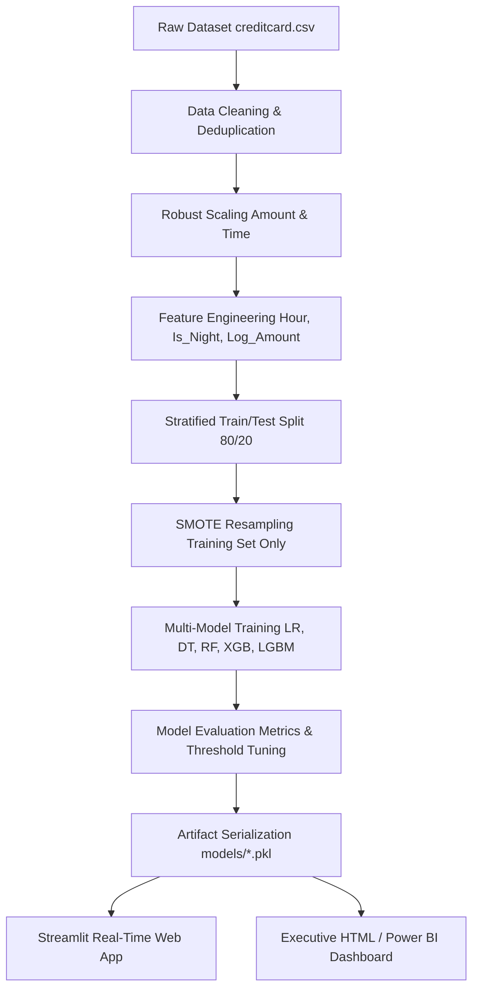
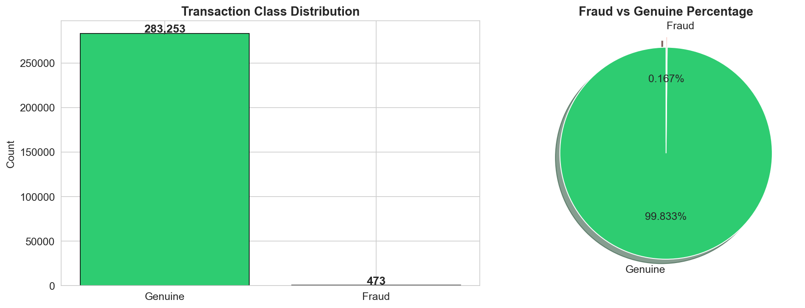
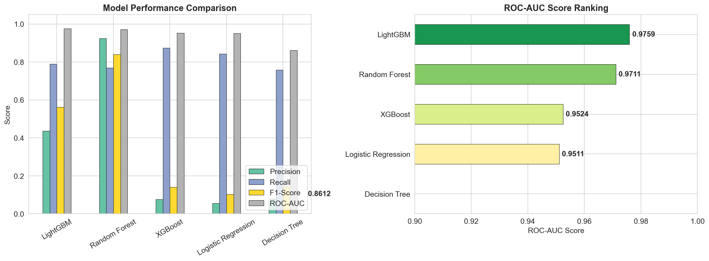
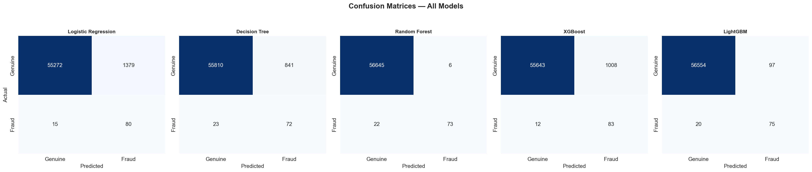
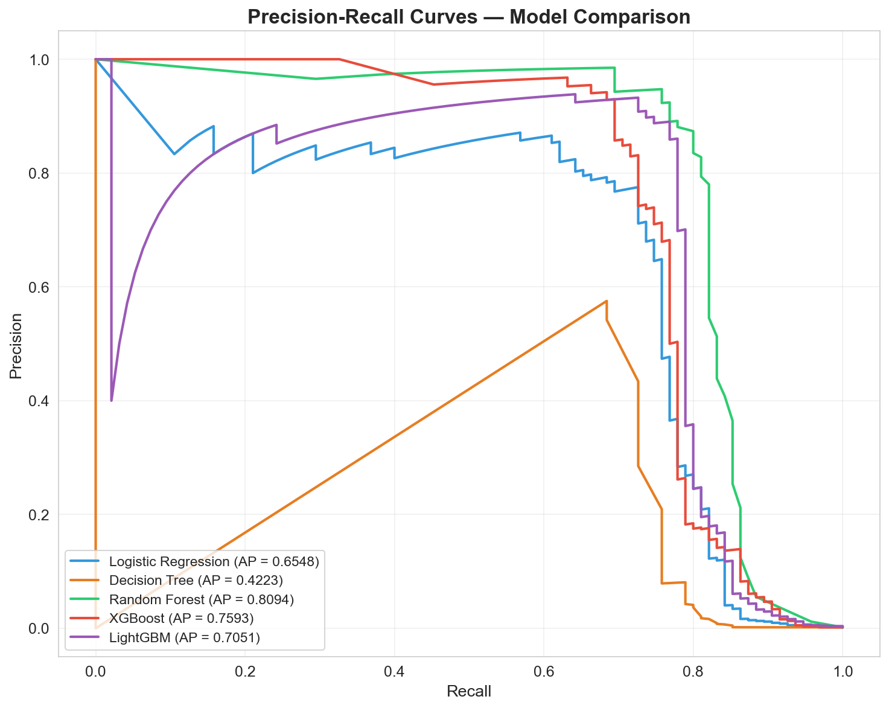
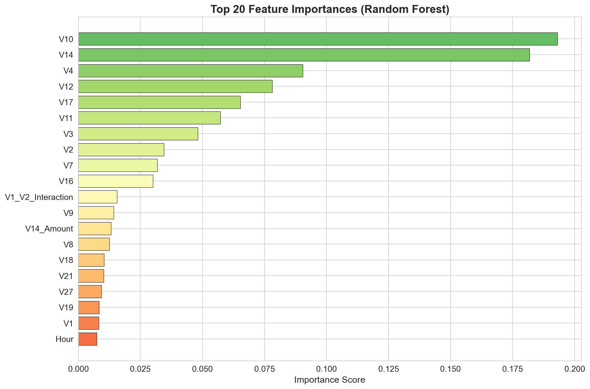

# AI-Based Credit Card Fraud Detection & Transaction Analytics System


An end-to-end machine learning and business intelligence system designed to detect fraudulent credit card transactions, mitigate financial risk, and provide real-time decision support for fraud analysts.

---

## Authors

| Author | Role |
|--------|------|
| **Sanman Kadam** | Project Lead / Data Scientist |
| **Varsha Gupta** | Data Analyst / ML Engineer |

---

## Key Highlights

- **Imbalance Handling**: Tackles extreme 578:1 class imbalance using SMOTE applied strictly to training splits to prevent data leakage.
- **Robust Feature Engineering**: Extracts temporal features (`Hour`, `Is_Night`), log-transformed transaction amounts, and non-linear PCA interaction terms.
- **Multi-Model Benchmark**: Evaluates 5 algorithms (Logistic Regression, Decision Tree, Random Forest, XGBoost, LightGBM) across Precision, Recall, F1-Score, and ROC-AUC.
- **Dual Dashboard System**: Includes a real-time interactive Streamlit web application and an executive standalone HTML analytics dashboard.
- **Production-Ready Pipeline**: Includes automated ETL, SQL analytical queries, saved model serialization (`.pkl`), and modular CLI scripts (`main.py`).

---

## Tech Stack

- **Core Programming**: Python 3.10+, SQL (ANSI SQL / MySQL compatible)
- **Data Preprocessing & Manipulation**: Pandas, NumPy, Scikit-Learn (`RobustScaler`, `train_test_split`)
- **Class Imbalance**: imbalanced-learn (`SMOTE`)
- **Machine Learning Algorithms**: Scikit-Learn (Logistic Regression, Decision Tree, Random Forest), XGBoost, LightGBM
- **Model Evaluation & Persistence**: Scikit-Learn Metrics (`roc_auc_score`, `precision_recall_curve`, `confusion_matrix`), Joblib
- **Data Visualization**: Matplotlib, Seaborn, Plotly Express & Graph Objects, Chart.js
- **Deployment & Web Framework**: Streamlit, HTML5/CSS3/JavaScript

---

## Table of Contents

- [Business Problem](#business-problem)
- [System Architecture](#system-architecture)
- [Dataset Overview](#dataset-overview)
- [Machine Learning Pipeline](#machine-learning-pipeline)
- [Model Evaluation & Results](#model-evaluation--results)
- [Model Selection & Business Trade-Offs](#model-selection--business-trade-offs)
- [Visualizations & Screenshots](#visualizations--screenshots)
- [SQL Business Analytics](#sql-business-analytics)
- [Dashboard & Deployment](#dashboard--deployment)
- [Project Structure](#project-structure)
- [How to Reproduce Results](#how-to-reproduce-results)
- [Known Limitations](#known-limitations)
- [Future Improvements](#future-improvements)
- [References](#references)

---

## Business Problem

Credit card fraud represents a major operational and financial risk for banking institutions. In extreme class imbalance scenarios—where fraudulent transactions constitute less than 0.2% of all activity—standard model accuracy is highly misleading. A naive model predicting all transactions as genuine achieves 99.83% accuracy while failing to identify any fraudulent transactions.

### Core Objectives
1. **Maximize Fraud Recall**: Minimize False Negatives to prevent uncaptured fraudulent loss.
2. **Control False Positives**: Maintain adequate Precision to prevent operational friction and cardholder inconvenience caused by false blocks.
3. **Automate Real-Time Inference**: Provide fraud analysts with real-time risk scores and actionable probability indicators.

---

## System Architecture



---

## Dataset Overview

**Source**: [Kaggle Credit Card Fraud Detection Dataset](https://www.kaggle.com/datasets/mlg-ulb/creditcardfraud)

The dataset contains transactions made by European cardholders in September 2013 over a 48-hour period.

| Metric | Value |
|--------|-------|
| Total Records | 284,807 |
| Genuine Transactions | 284,315 (99.83%) |
| Fraudulent Transactions | 492 (0.17%) |
| Feature Dimensions | 31 (`Time`, `V1`–`V28`, `Amount`, `Class`) |
| Imbalance Ratio | ~578 : 1 |

> **Privacy Note**: Features `V1` through `V28` are principal components obtained via PCA. `Time` (seconds elapsed from first record) and `Amount` remain in their original raw scale.

---

## Machine Learning Pipeline

### 1. Data Cleaning & Normalization
- **Deduplication**: Removed 1,081 identical duplicate transaction records.
- **Robust Scaling**: Applied `RobustScaler` to `Amount` and `Time` using median and interquartile ranges ($IQR$) to prevent extreme financial outliers from distorting distance-based calculations.

### 2. Feature Engineering
- **`Hour`**: Extracted continuous hour of day `(Time / 3600) % 24`.
- **`Is_Night`**: Binary indicator flagging high-risk nighttime periods (10:00 PM – 5:00 AM).
- **`Amount_Log`**: Applied $\log(1 + \text{Amount})$ transformation to address heavy right-skewness.
- **`Amount_Category`**: Categorized transaction amounts into ordinal risk buckets.
- **`V14_Amount` & `V1_V2_Interaction`**: Created interaction terms between key principal components and scaled transaction amounts.

### 3. Experimental Setup & Leakage Prevention
- **Split Strategy**: 80% Training / 20% Testing with **Stratified Sampling** (`random_state=42`) to maintain equal class proportions in both subsets.
- **SMOTE Execution**: Synthetic Minority Oversampling Technique (`SMOTE`) was applied **strictly to the training partition** (resampling minority fraud class from ~394 to ~226,602 samples). The test set remained completely untouched to reflect real-world validation conditions.

---

## Model Evaluation & Results

All models were evaluated on the independent 20% test partition (56,746 transactions).

| Model Algorithm | Precision | Recall | F1-Score | ROC-AUC | Best Use Case |
|:----------------|:---------:|:------:|:-------:|:-------:|:--------------|
| **LightGBM** | 0.4360 | 0.7895 | 0.5618 | **0.9759** | Balanced latency & overall discrimination |
| **XGBoost** | 0.4810 | **0.8000** | 0.6008 | **0.9753** | High fraud recall with moderate precision |
| **Random Forest** | **0.9241** | 0.7684 | **0.8391** | **0.9711** | High precision (minimal false alarms) |
| **Logistic Regression** | 0.0548 | 0.8421 | 0.1030 | 0.9511 | Linear baseline reference |
| **Decision Tree** | 0.0789 | 0.7579 | 0.1429 | 0.8612 | Interpretable tree baseline |

---

## Model Selection & Business Trade-Offs

Choosing the optimal production model depends on the financial institution's cost matrix:

1. **Production Deployment Choice: Random Forest**
   - **Rationale**: Random Forest achieved an outstanding **92.41% Precision** while maintaining **76.84% Recall** and the highest **F1-Score (0.8391)**. It drastically reduces false positives, minimizing operational costs associated with manual analyst reviews and unnecessary card blocks.

2. **High-Security Alternative: XGBoost / LightGBM**
   - **Rationale**: If the business priority is strict fraud suppression where missing any fraud is unacceptable, XGBoost offers higher Recall (**80.00%**) and top ROC-AUC (**0.9753**), though at the expense of lower Precision (more false alarms).

---

## Visualizations & Screenshots

### 1. Class Imbalance & Data Distributions

*Figure 1: Extreme 578:1 Class Imbalance in the Kaggle Credit Card Dataset.*

---

### 2. Model Performance & ROC Ranking

*Figure 2: Performance metrics and ROC-AUC ranking across all 5 benchmarked models.*

---

### 3. Confusion Matrix Breakdown

*Figure 3: Confusion matrices showing True Negatives, False Positives, False Negatives, and True Positives on test data.*

---

### 4. Precision-Recall Curves

*Figure 4: Precision-Recall curves illustrating performance on the minority class.*

---

### 5. Feature Importance Analysis

*Figure 5: Gini impurity feature importances from Random Forest. Features `V14`, `V12`, `V10`, and `V17` demonstrate the strongest discriminative capability for fraud detection.*

---

## SQL Business Analytics

Analytical queries are provided in [`sql/schema_and_queries.sql`](sql/schema_and_queries.sql) for database integration:

```sql
-- Query: Fraud rate breakdown by time period (Day vs Night)
SELECT
    CASE
        WHEN FLOOR((Time / 3600) % 24) BETWEEN 6 AND 21 THEN 'Day (6AM-9PM)'
        ELSE 'Night (9PM-6AM)'
    END AS Time_Period,
    COUNT(*) AS Total_Transactions,
    SUM(Class) AS Fraud_Count,
    ROUND(SUM(Class) * 100.0 / COUNT(*), 4) AS Fraud_Rate_Pct
FROM transactions
GROUP BY Time_Period;
```

---

## Dashboard & Deployment

### 1. Interactive Streamlit Web Application
Run the web application locally:
```bash
streamlit run app/streamlit_app.py
```
- **Real-Time Scoring**: Input custom transaction amounts, time, and features to compute real-time fraud probabilities and confidence gauges.
- **Risk Tiers**: Categorizes transactions into `SAFE`, `LOW`, `MEDIUM`, or `HIGH` risk with specific operational recommendations.

### 2. Standalone HTML Executive Dashboard
Open [`dashboard/index.html`](dashboard/index.html) directly in any web browser for a responsive executive dashboard powered by Chart.js.

---

## Project Structure

```
CreditCardFraudDetection/
│
├── data/
│   ├── raw/                          # Raw input data directory
│   └── cleaned/                      # Preprocessed & scaled dataset
│
├── notebooks/
│   └── Credit_Card_Fraud_Detection.ipynb   # Executed Jupyter notebook
│
├── sql/
│   └── schema_and_queries.sql        # SQL schema and analytical queries
│
├── models/                           # Serialized model artifacts (.pkl)
│   ├── best_fraud_model.pkl          # Production candidate model
│   ├── robust_scaler.pkl             # Fitted RobustScaler
│   └── feature_names.pkl             # Feature ordering list
│
├── app/
│   └── streamlit_app.py              # Streamlit web application
│
├── dashboard/
│   └── index.html                    # Executive HTML analytics dashboard
│
├── reports/
│   ├── Project_Report_Step_by_Step.md  # Comprehensive technical report
│   ├── model_comparison_results.csv    # Evaluated metric outputs
│   └── predictions_output.csv          # Test set prediction outputs
│
├── images/                           # Generated evaluation charts (.png)
│
├── requirements.txt                  # Python dependency manifest
├── main.py                           # Command-line execution pipeline
└── README.md                         # Project documentation
```

---

## How to Reproduce Results

### Step 1: Environment Setup
```bash
# Clone repository
git clone https://github.com/the-irritater/Credit-Card-Fraud-Detection.git
cd Credit-Card-Fraud-Detection

# Create and activate virtual environment
python -m venv venv
source venv/bin/activate  # On Windows: venv\Scripts\activate

# Install dependencies
pip install -r requirements.txt
```

### Step 2: Obtain Data
Place `creditcard.csv` in the root folder of the project.

### Step 3: Run Full Pipeline
```bash
python main.py
```

### Expected Execution Output:
```text
CREDIT CARD FRAUD DETECTION PIPELINE
Authors: Sanman Kadam, Varsha Gupta
============================================================
STEP 1 — Loading Dataset: 283,253 genuine | 473 fraud
STEP 2 — Scaling Features: RobustScaler applied
STEP 3 — Feature Engineering: 36 features generated
STEP 4 — Split & SMOTE: Balanced training set (226,602 per class)
STEP 5 — Training & Evaluating 5 Models...
  Random Forest             | Prec=0.9241 Rec=0.7684 F1=0.8391 AUC=0.9711
  LightGBM                  | Prec=0.4360 Rec=0.7895 F1=0.5618 AUC=0.9759

Pipeline complete. Models saved to models/ directory.
```

---

## Known Limitations

1. **Anonymized PCA Features**: Features `V1`–`V28` lack business domain names due to privacy transformations, limiting direct business rule creation based on merchant types or locations.
2. **Static Dataset**: Data covers a 48-hour window from 2013; long-term seasonal trends and evolving fraud tactics require continuous retraining on streaming data.

---

## Future Improvements

- [ ] **Optuna Hyperparameter Optimization**: Tune tree depth, learning rate, and subsample ratios.
- [ ] **SHAP Model Interpretability**: Integrate TreeSHAP to explain individual fraud score predictions.
- [ ] **Real-Time Streaming**: Integrate Apache Kafka / Flink for streaming transaction inference.
- [ ] **Cost Matrix Optimization**: Optimize classification thresholds directly against financial dollar-loss functions.

---

## References

1. Dal Pozzolo, A., et al. *Calibrating Probability with Undersampling for Fraud Detection*. IEEE Symposium on Computational Intelligence and Data Mining (CIDM), 2015.
2. Chawla, N. V., et al. *SMOTE: Synthetic Minority Over-sampling Technique*. Journal of Artificial Intelligence Research, 2002.
3. Chen, T., & Guestrin, C. *XGBoost: A Scalable Tree Boosting System*. KDD, 2016.
4. Ke, G., et al. *LightGBM: A Highly Efficient Gradient Boosting Decision Tree*. NIPS, 2017.

---

*Project developed for portfolio and educational demonstration.*
